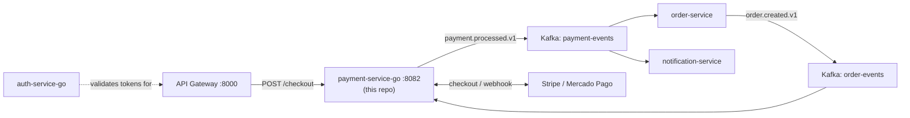

# payment-service-go

🇧🇷 [Português](README.md) | 🇬🇧 English


[](https://github.com/Adriano-silva131/order-hub)

Payment domain service for **[OrderHub](https://github.com/Adriano-silva131/order-hub)**, written in Go with Clean Architecture. Owns the full payment lifecycle: staging a payment when an order is created, starting a real checkout session with **Stripe** (card) or **Mercado Pago** (pix/boleto), and resolving the result via gateway webhooks. Sandbox/test credentials only.

## About OrderHub

This service is one piece of **[OrderHub](https://github.com/Adriano-silva131/order-hub)**, an event-driven e-commerce platform built as a portfolio project: an API Gateway in front of independently-deployable services (order, catalog, payment, notification) communicating over Kafka, plus a full observability stack (Prometheus, Grafana, Tempo, Loki). This repo and **[auth-service-go](https://github.com/Adriano-silva131/auth-service-go)** (JWT authentication) round out the platform's Go services.



## What this service demonstrates

- **Clean Architecture in Go** — domain and use cases have zero framework imports; adapters are swapped via interfaces defined by the use case layer, not the other way around (see [Architecture](#architecture)).
- **Two real payment gateway integrations** (Stripe Checkout Sessions, Mercado Pago Preferences) with signature-verified webhooks, not a mocked/simulated approval flow.
- **Event-driven resilience**: a retry-topic + dead-letter-table pipeline built from scratch on top of `franz-go` (see [Retry + Dead Letter Table](#retry--dead-letter-table)).
- **Idempotency and authorization correctness at every layer**: payments are staged once per order (event idempotency); checkout requests are rejected if the caller's identity (forwarded by the gateway) doesn't match the order's owner; a concurrent/retried `POST /checkout` for the same order is rejected with `409` by an atomic conditional `UPDATE` (`PENDING` → `CHECKOUT_STARTED`) rather than a racy read-then-write check; and the checkout call itself carries a stable idempotency key to both Stripe and Mercado Pago, so a network-level retry resolves to the same gateway session instead of creating a duplicate one.
- **Distributed observability**: OpenTelemetry traces propagated across both HTTP and Kafka (custom header carrier — franz-go has no built-in propagator), correlated with structured JSON logs (`trace_id`/`span_id` injected into every log line) and exported to Tempo/Grafana; Prometheus metrics alongside.
- **Tests that actually exercise Postgres**: `testcontainers-go` integration tests run this repo's own migrations against a real database, not mocks.

## Architecture

Clean Architecture / ports & adapters:

```
cmd/payment-service   composition root — wiring only, no business logic
internal/domain       Payment, DltMessage — zero external imports
internal/usecase      StagePayment, StartCheckout, HandleWebhook + the ports
                       (PaymentRepository, EventPublisher, PaymentGateway) adapters implement
internal/adapter/
  http                chi router, checkout/webhook/health handlers
  kafka               order-events consumer, retry topic consumer, producer, DLT wiring
  postgres            pgx-based repositories
  gateway/stripe       Stripe adapter (Checkout Sessions)
  gateway/mercadopago  Mercado Pago adapter (Preferences)
  dlt                 scheduled dead-letter reprocessing
  metrics             Prometheus counters
  otel                OpenTelemetry TracerProvider setup (OTLP/gRPC exporter)
  logging             slog handler that injects trace_id/span_id into every log line
migrations/           golang-migrate SQL files
```

`usecase` only depends on `domain` and the interfaces in `usecase/ports.go` — never on a concrete `adapter/*` package. Adapters implement those interfaces; `main.go` is the only place concrete adapters get wired together.

## Payment flow

1. `order.created.v1` (topic `order-events`) arrives → `StagePayment` idempotently inserts a `PENDING` row.
2. Client calls `POST /api/v1/payments/checkout` with `{orderId, paymentMethod: "STRIPE"|"MERCADOPAGO"}`, authenticated via the API Gateway, which forwards the caller's identity as `X-User-Id` → `StartCheckout` rejects with 403 if that id doesn't match the payment's `CustomerID` (set from the trusted `order.created.v1` event, never from client input). It then atomically claims the payment (`PENDING` → `CHECKOUT_STARTED`) with a single conditional `UPDATE`; if a concurrent or retried call already claimed it, this one gets 409 instead of racing it to the gateway. Only the claim's winner creates the real checkout session — with a stable, per-order idempotency key sent to the gateway — and returns a redirect URL. If the gateway call fails, the claim is released back to `PENDING` so the order can be retried.
3. The gateway calls back `POST /api/v1/payments/webhooks/stripe` or `/mercadopago` → the signature is verified, the payment is resolved to `APPROVED`/`REJECTED`, and `payment.processed.v1` is published to `payment-events`, carrying `customerEmail`, `gateway`, and `gatewayTransactionId`.

No automatic fallback between gateways: Stripe and Mercado Pago cover different payment methods (card vs. pix/boleto), the client picks one explicitly.

## Retry + Dead Letter Table

A retry pipeline for `order-events` consumption failures, without automatic per-attempt topic suffixing:

- One retry topic (`order-events-retry`) instead of N suffixed topics, carrying `x-retry-attempt` / `x-retry-not-before-ms` / `x-original-topic` headers.
- The main consumer never blocks on a failing message — it republishes to the retry topic and moves on.
- The retry consumer waits out each message's backoff window (2s→4s→8s, capped at 10s), retries up to 4 times total, then writes it to `dlt_messages` (idempotency guarded by a partial unique index on `(original_topic, message_key)` where `status = 'PENDING'`).
- A goroutine reprocesses pending DLT rows every `DLT_REPROCESS_INTERVAL_MS` (default 60000), using `SELECT ... FOR UPDATE SKIP LOCKED` inside a transaction so multiple instances can safely run the reprocessing loop concurrently.

## Observability

Traces are created for every HTTP request (`otelhttp` middleware) and propagated across service boundaries via the standard W3C `traceparent` header — including over Kafka, where `internal/adapter/kafka/trace_carrier.go` implements a `propagation.TextMapCarrier` on top of `kgo.RecordHeader`, since `franz-go` has no built-in OpenTelemetry integration. That means a single trace can span **API Gateway → payment-service HTTP → Kafka → payment-service consumer**, all stitched together.

Every log line is JSON (`slog`), and `internal/adapter/logging.TraceHandler` wraps the base handler to inject the active span's `trace_id`/`span_id` into each record — so a trace found in Grafana Tempo can be pivoted straight into its matching logs in Loki. Traces export via OTLP/gRPC (`OTEL_EXPORTER_OTLP_ENDPOINT`, default `http://otel-collector:4317`) to the OrderHub stack's collector, which forwards to Tempo; `/metrics` exposes Prometheus counters independently of tracing.

## Running locally

Standalone service — its own `Dockerfile`, its own migrations (run automatically on container boot by `docker-entrypoint.sh`), and its only runtime dependencies are a Postgres instance and a Kafka broker it talks to over the network, configured entirely via `DATABASE_URL` / `KAFKA_BROKERS`. No compile-time or runtime dependency on any other service's code.

```bash
cp .env.example .env   # point at your own Postgres/Kafka, fill in real Stripe/Mercado Pago sandbox credentials
export $(cat .env | xargs)
make migrate-up
make run
```

Or as a container:

```bash
docker build -t payment-service-go .
docker run --env-file .env -p 8082:8082 payment-service-go
```

For local integration testing against the rest of OrderHub, the [order-hub](https://github.com/Adriano-silva131/order-hub) compose stack provisions a Postgres/Kafka pair and the API Gateway in front of everything — cloning it as a sibling directory lets its compose file build this repo automatically (context `../../payment-service-go`, overridable via `PAYMENT_SERVICE_GO_PATH`). That's a convenience for running the full platform end to end, not a requirement to run this service.

### Testing sandbox webhooks locally

**Stripe** — forward events with the [Stripe CLI](https://docs.stripe.com/stripe-cli), pointed at the API Gateway (not this service directly):

```bash
stripe listen --forward-to localhost:8000/api/v1/payments/webhooks/stripe
```

The CLI prints its own `whsec_...` signing secret on startup — use that as `STRIPE_WEBHOOK_SECRET` for local runs (it's different from the one in the Dashboard, which only works for a publicly reachable endpoint).

**Mercado Pago** — no CLI equivalent; their sandbox needs a public URL to call back to, so tunnel the API Gateway with ngrok instead:

```bash
ngrok http 8000
```

Then register `https://<ngrok-id>.ngrok-free.app/api/v1/payments/webhooks/mercadopago` in the Mercado Pago sandbox dashboard.

## Tests

```bash
make test              # unit tests (fakes, no external deps)
make test-integration  # testcontainers-go: real Postgres, runs this repo's own migrations
```

## Library choices

| Concern | Library | Why |
|---|---|---|
| HTTP router | `go-chi/chi/v5` | stdlib-compatible, minimal |
| Postgres | `jackc/pgx/v5` | de facto standard driver, better than `lib/pq` |
| Migrations | `golang-migrate/migrate/v4` | plain SQL migrations, no ORM lock-in |
| Kafka | `twmb/franz-go` | pure Go, no cgo/librdkafka |
| Metrics | `prometheus/client_golang` | official client, exposes `/metrics` |
| Tracing | `go.opentelemetry.io/otel` + `otlptracegrpc` | vendor-neutral, ships traces to the OrderHub stack's OTel Collector → Tempo |
| Stripe | `stripe/stripe-go/v86` | official SDK, `webhook.ConstructEvent` handles signature verification |
| Mercado Pago | `mercadopago/sdk-go` | official SDK; webhook signature verification is hand-rolled HMAC-SHA256 per their docs (no SDK helper for it) |
| Config | `caarlos0/env/v11` | struct-tag env parsing, fails fast on missing required vars |
| Decimal | `shopspring/decimal` | avoids float precision issues for money |
| Tests | `stretchr/testify` + `testcontainers-go` | assertions + real-Postgres integration tests |

Repositories are hand-written `pgx` queries rather than `sqlc`-generated code — `sqlc` was the original plan for compile-time-checked SQL, but was dropped to avoid requiring a code-gen step/extra tool on every contributor's machine for a project this size. Worth revisiting if the schema grows.

## Related repositories

| Repo | Stack | Role |
|---|---|---|
| [order-hub](https://github.com/Adriano-silva131/order-hub) | Java 21 / Spring Boot | Main platform: API Gateway, order/catalog/notification services, infra (Docker Compose, Kafka, Postgres, MongoDB, Redis, Prometheus/Grafana/Tempo/Loki) |
| [auth-service-go](https://github.com/Adriano-silva131/auth-service-go) | Go | JWT authentication (register/login/refresh, RS256 + JWKS), same Clean Architecture layout as this repo |
| **payment-service-go** (this repo) | Go | Payment processing — Stripe / Mercado Pago checkout and webhooks |

## License

Distributed under the [MIT license](LICENSE).
