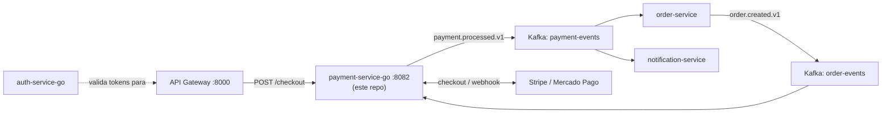

# payment-service-go

🇧🇷 Português | 🇬🇧 [English](README.en.md)


[](https://github.com/Adriano-silva131/order-hub)

Serviço de pagamento do **[OrderHub](https://github.com/Adriano-silva131/order-hub)**, escrito em Go com Clean Architecture. Cobre todo o ciclo de vida do pagamento: staging de um pagamento quando um pedido é criado, abertura de uma sessão de checkout real com **Stripe** (cartão) ou **Mercado Pago** (pix/boleto), e resolução do resultado via webhooks dos gateways. Somente credenciais de sandbox/teste.

## Sobre o OrderHub

Este serviço é uma peça do **[OrderHub](https://github.com/Adriano-silva131/order-hub)**, uma plataforma de e-commerce orientada a eventos construída como projeto de portfólio: um API Gateway na frente de serviços independentemente implantáveis (order, catalog, payment, notification) que se comunicam via Kafka, além de uma stack completa de observabilidade (Prometheus, Grafana, Tempo, Loki). Este repositório e o **[auth-service-go](https://github.com/Adriano-silva131/auth-service-go)** (autenticação JWT) completam os serviços em Go da plataforma.



## O que este serviço demonstra

- **Clean Architecture em Go** — domínio e casos de uso sem nenhum import de framework; adapters são trocáveis via interfaces definidas pela camada de use case, nunca o contrário (ver [Arquitetura](#arquitetura)).
- **Duas integrações reais de gateway de pagamento** (Stripe Checkout Sessions, Mercado Pago Preferences) com webhooks com assinatura verificada — não um fluxo de aprovação simulado/mockado.
- **Resiliência orientada a eventos**: um pipeline de retry-topic + dead-letter-table construído do zero sobre o `franz-go` (ver [Retry + Dead Letter Table](#retry--dead-letter-table)).
- **Idempotência e correção de autorização em cada camada**: pagamentos são staged uma única vez por pedido (idempotência de evento); requisições de checkout são rejeitadas se a identidade de quem chama (repassada pelo gateway) não bater com a dona do pedido; um `POST /checkout` concorrente ou reenviado pro mesmo pedido é rejeitado com `409` por um `UPDATE` condicional atômico (`PENDING` → `CHECKOUT_STARTED`), em vez de um check-then-act sujeito a corrida; e a própria chamada de checkout carrega uma idempotency key estável tanto pra Stripe quanto pro Mercado Pago, então um retry em nível de rede resolve pra mesma sessão no gateway em vez de criar uma duplicada.
- **Observabilidade distribuída**: traces do OpenTelemetry propagados tanto via HTTP quanto via Kafka (carrier de headers escrito à mão — o franz-go não tem propagador nativo), correlacionados com logs estruturados em JSON (`trace_id`/`span_id` injetados em cada linha) e exportados para Tempo/Grafana; métricas Prometheus em paralelo.
- **Testes que realmente batem no Postgres**: testes de integração com `testcontainers-go` rodam as próprias migrations deste repositório contra um banco real, não mocks.

## Arquitetura

Clean Architecture / ports & adapters:

```
cmd/payment-service   composition root — só wiring, nenhuma regra de negócio
internal/domain       Payment, DltMessage — zero imports externos
internal/usecase      StagePayment, StartCheckout, HandleWebhook + as portas
                       (PaymentRepository, EventPublisher, PaymentGateway) que os adapters implementam
internal/adapter/
  http                router chi, handlers de checkout/webhook/health
  kafka               consumer de order-events, consumer do retry topic, producer, wiring do DLT
  postgres            repositórios via pgx
  gateway/stripe       adapter da Stripe (Checkout Sessions)
  gateway/mercadopago  adapter do Mercado Pago (Preferences)
  dlt                 reprocessamento agendado do dead-letter
  metrics             contadores Prometheus
  otel                setup do TracerProvider do OpenTelemetry (exportador OTLP/gRPC)
  logging             handler do slog que injeta trace_id/span_id em cada linha de log
migrations/           arquivos SQL do golang-migrate
```

`usecase` depende só de `domain` e das interfaces em `usecase/ports.go` — nunca de um pacote `adapter/*` concreto. Os adapters implementam essas interfaces; `main.go` é o único lugar onde os adapters concretos são conectados.

## Fluxo de pagamento

1. `order.created.v1` (tópico `order-events`) chega → `StagePayment` insere idempotentemente uma linha `PENDING`.
2. Cliente chama `POST /api/v1/payments/checkout` com `{orderId, paymentMethod: "STRIPE"|"MERCADOPAGO"}`, autenticado via API Gateway, que repassa a identidade de quem chama no header `X-User-Id` → `StartCheckout` rejeita com 403 se esse id não bater com o `CustomerID` do pagamento (definido a partir do evento confiável `order.created.v1`, nunca do input do cliente). Em seguida, reivindica o pagamento atomicamente (`PENDING` → `CHECKOUT_STARTED`) com um único `UPDATE` condicional; se uma chamada concorrente ou reenviada já tiver reivindicado, essa recebe 409 em vez de correr pro gateway junto com a outra. Só quem venceu a reivindicação cria a sessão de checkout real — com uma idempotency key estável por pedido enviada ao gateway — e devolve uma URL de redirecionamento. Se a chamada ao gateway falhar, a reivindicação é liberada de volta pra `PENDING`, permitindo retry.
3. O gateway chama de volta `POST /api/v1/payments/webhooks/stripe` ou `/mercadopago` → a assinatura é verificada, o pagamento é resolvido para `APPROVED`/`REJECTED`, e `payment.processed.v1` é publicado em `payment-events`, carregando `customerEmail`, `gateway` e `gatewayTransactionId`.

Sem fallback automático entre gateways: Stripe e Mercado Pago cobrem métodos de pagamento diferentes (cartão vs. pix/boleto), quem escolhe é o cliente, explicitamente.

## Retry + Dead Letter Table

Um pipeline de retry para falhas no consumo de `order-events`, sem sufixo automático de tópico por tentativa:

- Um único tópico de retry (`order-events-retry`) em vez de N tópicos sufixados, carregando os headers `x-retry-attempt` / `x-retry-not-before-ms` / `x-original-topic`.
- O consumer principal nunca bloqueia numa mensagem com falha — ele republica no tópico de retry e segue em frente.
- O consumer de retry espera a janela de backoff de cada mensagem (2s→4s→8s, limitado a 10s), tenta até 4 vezes no total, e então grava em `dlt_messages` (idempotência garantida por um índice único parcial em `(original_topic, message_key)` onde `status = 'PENDING'`).
- Uma goroutine reprocessa as linhas pendentes do DLT a cada `DLT_REPROCESS_INTERVAL_MS` (padrão 60000), usando `SELECT ... FOR UPDATE SKIP LOCKED` dentro de uma transação, permitindo que múltiplas instâncias rodem o loop de reprocessamento com segurança em paralelo.

## Observabilidade

Traces são criados para toda requisição HTTP (middleware `otelhttp`) e propagados entre os limites de serviço via o header padrão W3C `traceparent` — inclusive sobre Kafka, onde `internal/adapter/kafka/trace_carrier.go` implementa um `propagation.TextMapCarrier` em cima de `kgo.RecordHeader`, já que o `franz-go` não tem integração nativa com OpenTelemetry. Isso significa que um único trace pode atravessar **API Gateway → HTTP do payment-service → Kafka → consumer do payment-service**, tudo costurado junto.

Toda linha de log é JSON (`slog`), e `internal/adapter/logging.TraceHandler` envolve o handler base pra injetar o `trace_id`/`span_id` do span ativo em cada registro — assim um trace encontrado no Grafana Tempo pode ser pivotado direto pros logs correspondentes no Loki. Os traces são exportados via OTLP/gRPC (`OTEL_EXPORTER_OTLP_ENDPOINT`, padrão `http://otel-collector:4317`) para o coletor da stack do OrderHub, que encaminha ao Tempo; `/metrics` expõe contadores Prometheus independentemente do tracing.

## Rodando localmente

Serviço standalone — tem seu próprio `Dockerfile`, roda suas próprias migrations (automaticamente, no boot do container, via `docker-entrypoint.sh`), e suas únicas dependências em tempo de execução são uma instância de Postgres e um broker Kafka acessíveis pela rede, configurados inteiramente via `DATABASE_URL` / `KAFKA_BROKERS`. Nenhuma dependência, em tempo de compilação ou execução, do código de outro serviço.

```bash
cp .env.example .env   # aponte pro seu próprio Postgres/Kafka, preencha credenciais reais de sandbox da Stripe/Mercado Pago
export $(cat .env | xargs)
make migrate-up
make run
```

Ou como container:

```bash
docker build -t payment-service-go .
docker run --env-file .env -p 8082:8082 payment-service-go
```

Para testes de integração locais com o resto do OrderHub, a stack do [order-hub](https://github.com/Adriano-silva131/order-hub) provisiona um par Postgres/Kafka e o API Gateway na frente de tudo — clonando-o como diretório irmão, o compose dele constrói este repositório automaticamente (context `../../payment-service-go`, sobrescrevível via `PAYMENT_SERVICE_GO_PATH`). Isso é uma conveniência pra rodar a plataforma completa de ponta a ponta, não um requisito pra rodar este serviço.

### Testando webhooks de sandbox localmente

**Stripe** — encaminhe os eventos com a [Stripe CLI](https://docs.stripe.com/stripe-cli), apontada pro API Gateway (não direto pra este serviço):

```bash
stripe listen --forward-to localhost:8000/api/v1/payments/webhooks/stripe
```

A CLI imprime seu próprio segredo de assinatura `whsec_...` ao iniciar — use esse valor como `STRIPE_WEBHOOK_SECRET` localmente (é diferente do segredo do Dashboard, que só funciona com um endpoint publicamente acessível).

**Mercado Pago** — sem equivalente de CLI; o sandbox deles precisa de uma URL pública pra chamar de volta, então em vez disso, abra um túnel no API Gateway com ngrok:

```bash
ngrok http 8000
```

Depois registre `https://<ngrok-id>.ngrok-free.app/api/v1/payments/webhooks/mercadopago` no dashboard de sandbox do Mercado Pago.

## Testes

```bash
make test              # testes unitários (fakes, sem dependências externas)
make test-integration  # testcontainers-go: Postgres real, roda as próprias migrations deste repositório
```

## Escolhas de bibliotecas

| Necessidade | Biblioteca | Por quê |
|---|---|---|
| Router HTTP | `go-chi/chi/v5` | compatível com stdlib, minimalista |
| Postgres | `jackc/pgx/v5` | driver padrão de fato, melhor que `lib/pq` |
| Migrations | `golang-migrate/migrate/v4` | migrations SQL puras, sem lock-in de ORM |
| Kafka | `twmb/franz-go` | Go puro, sem cgo/librdkafka |
| Métricas | `prometheus/client_golang` | client oficial, expõe `/metrics` |
| Tracing | `go.opentelemetry.io/otel` + `otlptracegrpc` | agnóstico de vendor, envia traces pro OTel Collector → Tempo da stack do OrderHub |
| Stripe | `stripe/stripe-go/v86` | SDK oficial, `webhook.ConstructEvent` cuida da verificação de assinatura |
| Mercado Pago | `mercadopago/sdk-go` | SDK oficial; verificação de assinatura do webhook é HMAC-SHA256 feito à mão conforme a doc deles (sem helper no SDK) |
| Config | `caarlos0/env/v11` | parsing de env via struct tags, falha rápido se faltar variável obrigatória |
| Decimal | `shopspring/decimal` | evita problemas de precisão de float pra dinheiro |
| Testes | `stretchr/testify` + `testcontainers-go` | assertions + testes de integração com Postgres real |

Os repositórios usam queries `pgx` escritas à mão em vez de código gerado pelo `sqlc` — `sqlc` era o plano original pra SQL checado em tempo de compilação, mas foi descartado pra não exigir um passo de code-gen/ferramenta extra na máquina de cada contribuidor, num projeto deste tamanho. Vale revisitar se o schema crescer.

## Repositórios relacionados

| Repo | Stack | Papel |
|---|---|---|
| [order-hub](https://github.com/Adriano-silva131/order-hub) | Java 21 / Spring Boot | Plataforma principal: API Gateway, serviços de order/catalog/notification, infra (Docker Compose, Kafka, Postgres, MongoDB, Redis, Prometheus/Grafana/Tempo/Loki) |
| [auth-service-go](https://github.com/Adriano-silva131/auth-service-go) | Go | Autenticação JWT (registro/login/refresh, RS256 + JWKS), mesmo layout de Clean Architecture deste repositório |
| **payment-service-go** (este repositório) | Go | Processamento de pagamento — checkout e webhooks Stripe / Mercado Pago |

## Licença

Distribuído sob a [licença MIT](LICENSE).
